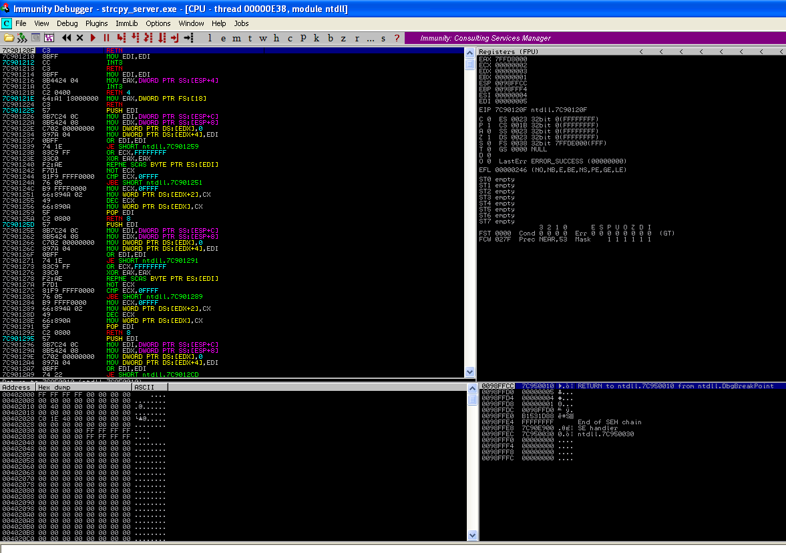
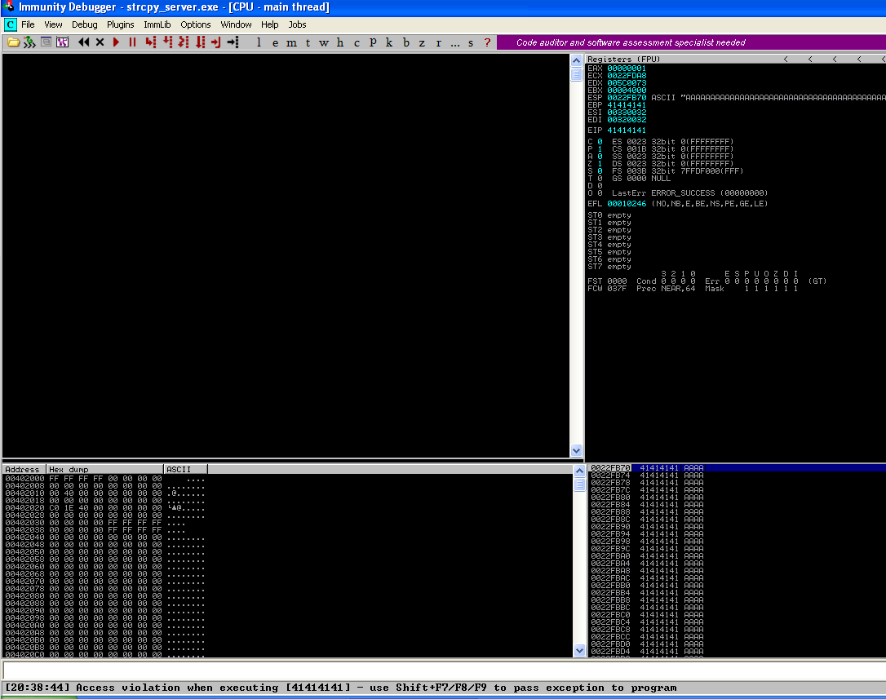

# immunity debugger basics ##

## ## immunity debugger ##

attach program process to immunity debugger

basic immunity debugger terminal explanation

* top left - disassembled code of the binary 
* top right - registers and their values
* bottom left - memory dump
* bottom right - stack

## ## debugger output after running exploit ##

Access violation when executing 41414141.

41 is the hex value for ascii "A". Remember we sent 500 "A's" in our buffer.

* top left - disassembled code of the binary 
  * this is empty because it does not know how to handle what is currently happening
* top right - registers and their values
  * shows the eip has been overwritten with "A's". important for later
* bottom left - memory dump
  * memory dump also shows that the stack has been over written with "A's", but it also shows where in memory this has happened. important for later.
* bottom right - stack
  * stack has been over written / over flowed with "A's"

