# immunity debugger scripting basics

## ## scripting options with ID ##

* PyCommands
* PyHooks
* PyPlugins

## ## PyCommands ##

* simple scripts using the immlib API's
* is not cached - can be changed at runtime
* quick prototyping 
  * python shell command
* needs to define a main() and return a string (shown in status box)
* may have arguments

## ## communicating results ##

* print to status box via return value
* print to log window
* print to a table
* write to a file

see file sigh-demo.py

write pycommands script

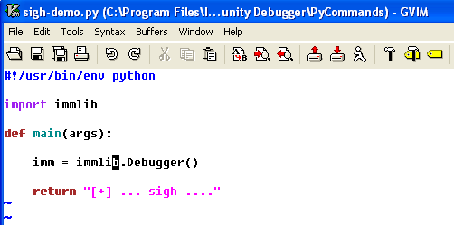

run script

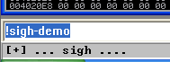

results also shown in log

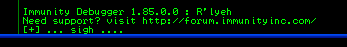

writing to a log file. add line to script

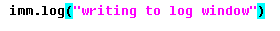

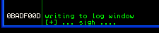

list pycommand commands. see our script highlighted in the command list. scripts in the pycommands directory are automatically added to this list.

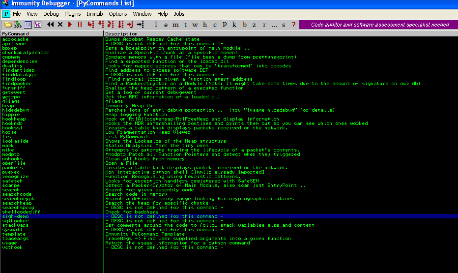

by double clicking on a pycommand from the above list, a little box will appear where you can add options if need be, press okay and pycommand will run. you can see in the status bar at the bottom the string we added in the pycommand was executed.

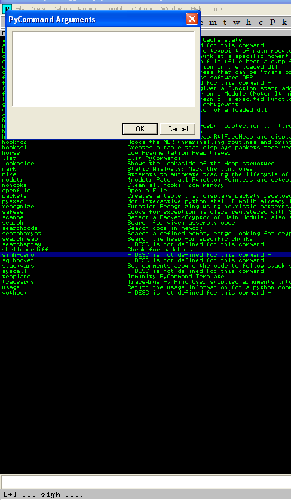

adding a description to your script in pycommands. edit your script and add:

DESC = "big sigh...."

rerun pycommands it the description will be visible.

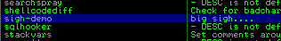

## ## programmatically list processes, service names, locations and display in a tabular way ##

* use immunity debugger api's

*  ps(self)
     list all active processes
   * returns: LIST
       a list of tuples with process information (pid, name, path, services, tcp list, udp list)

start testing by running it in the python terminal within immunity debugger. immlib loaded by default.

list processes in python console using ps

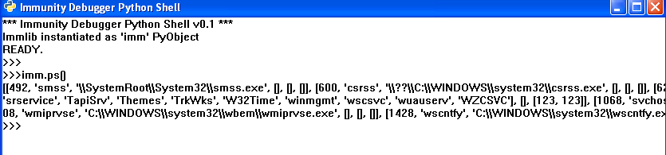

not a great way to read. make it more readable by putting it in a table.

once you run the cmd, the table pops up, shows a table where you can list pids and names. now lets try to populate these tables.

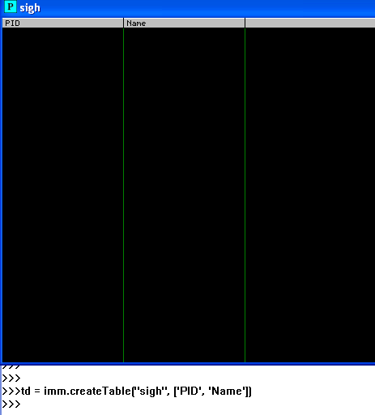

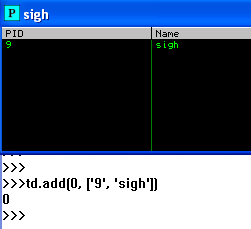

table got populated with the data we specified. now lets try to populate the table with the actual ps data.

add to your script.

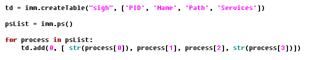

run the script

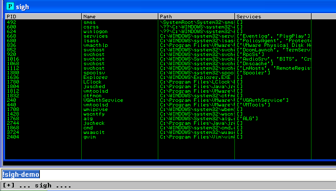
