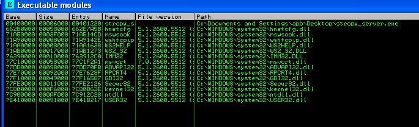
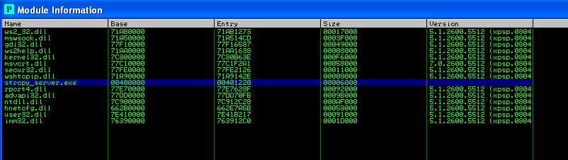
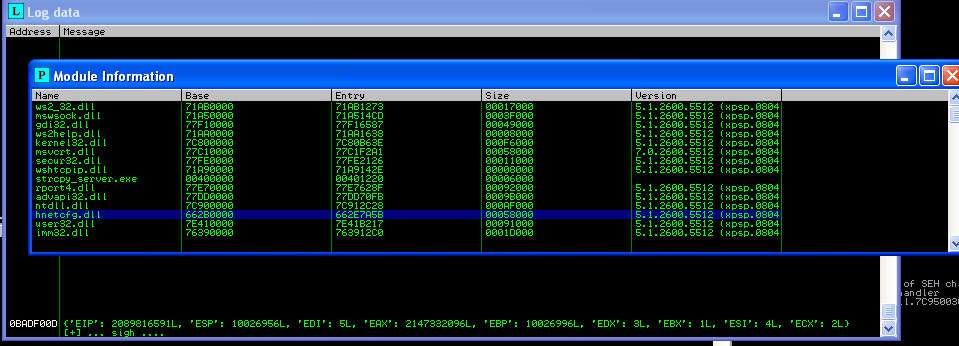

# processes in-depth #


## ## emulate gui instructions in code ##

* open / attach to a process

* find list of all modules in the process
  * name
  * base address
  * size
  * entry point
  * version


## ## pycommands script to attach processes to IM"

run !script-name in IM to execute the script.

```python 

#!/usr/bin/env python

import immlib

DESC = "processes.. sigh.."

def main(args):
    
    imm = immlib.Debugger()

# attach program to IM by specifying program location
    imm.openProcess("C:\\Documents and Settings\\apb\\Desktop\\strcpy_server.exe")

# attach program to IM by specifying program process ID
    imm.Attach(int(args[0]))

    return "[+] ... sigh ...."

```


## ## recreate "executeable modules" table with code ##

Once you have a proccess attached, you can go View --> Executable Modules (or Alt-E) which will then open a new table with executable modules associated with the loaded process. 



```python
# create table

    td = imm.createTable("Module Information", ['Name', 'Base', 'Entry', 'Size', 'Version']) 

    moduleList = imm.getAllModules()

    for entity in moduleList.values() :
        td.add(0, [ entity.getName(),
                    '%08X'%entity.getBaseAddress(),
                    '%08X'%entity.getEntry(),
                    '%08X'%entity.getSize(),
                    entity.getVersion()
                    ])

```




Get CPU registers

```python
## get CPU registers        
    imm.log(str(imm.getRegs()))
```




